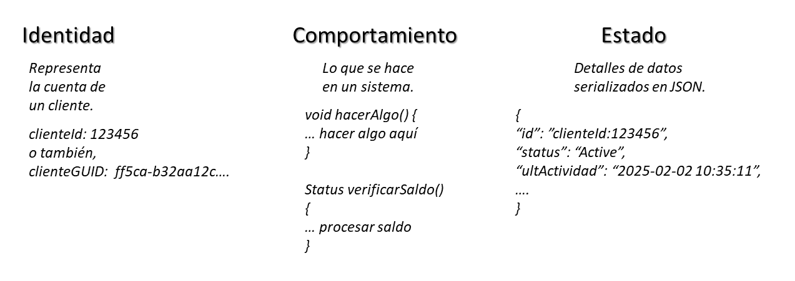

# Simulación de un ATM utilizando Microsoft Orleans y Azure Storage

## Fundamento

En esta oportunidad vamos a crear una aplicación muy simplificada de las funcionalidades de un clásico ATM bancario. Haremos uso de Microsoft Orleans para poder gestionar la aplicación. En esta ocasión conoceremos algunos detalles importantes de este framework. Profundizaremos un poco sobres los conceptos vinculados a los actores, granos, silos, identificadores, comportamiento y estados. Por otra parte, nuestro ATM lo que estará haciendo es utilizar algunas funciones muy básicas, aquellas que son de usos más frecuentes, tales como la extracción, depósito y la consulta de saldos. La siguiente aplicación cuenta con una API Rest junto a un contrato para la manipulación general de la aplicación.

## Conceptos Importantes

A continuación, vamos a describir muy somera y rápidamente algunos conceptos específicos acerca de Microsoft Orleans. Para mayores detalles, te recomiendo que te dirijas a la documentación oficial de Microsoft [aquí](https://github.com/pandao/editor.md "aquí").

Desde la figura 1 pasamos muy rápidamente a describir cada uno de los elementos.

- _El Grain representa un Actor virtual._
- _El Silo aloja y administra los Grains._
- _Los Grains se activan automáticamente cuando el Client los llama._

Por otra parte, un ATM bancario se trata de un dispositivo que sirve para suministrar dinero físico a un cliente de un banco de manera automática. Actualmente, un ATM también podría tratarse de cualquier aplicación de monedero digital. Si bien, un dipositivo es físico y el otro es virtual, en esencia, de fondo las operaciones que realizan ambos son muy parecidas.

En nuestra aplicación de simulación de ATM estaremos utilizando cuatro operaciones, de las cuales, tres de ellas son la obtención del saldo de la cuenta, la extracción de dinero o el depósito del mismo. Una cuarta función estaría básicamente vinculada con la creación de una nueva cuenta.

Retornando al concepto de **Grain** "_granos_", este representa a un **Actor**. Este actor puede contener tres elementos fundamentales; identidad, comportamiento y estado. Ver figura 2.

Como podemos apreciar en la figura 2, cada una de las partes contribuye a la descripción general de lo que es representado como una Actor virtual, valiéndose de los granos Grain. La identidad es utilizada para poder obtener un unico grano y, a su vez, para luego, ser más sencillo de recuperar debido a que a este Grain se le asigna un único valor, ya sea este un formato basado en un número entero, como lo son los ID clasicos o bien, a través de una clase Guid y que se trata de una clase específica del ambiente de desarrollo de .NET que genstiona código UUID (_Universal Unique Identifier_).

El comportamiento nos permite determinar las disitntas operaciones que tiene como responsabilidad el Grain. En el caso de nuestro ejemplo del ATM bancario, podrían tratarse de operaciones tales como extracción, depósito, consultas, etc.

Finalmente, el estado se trata básicamente de las condiciones de información o datos en las que se encuentra este Grain. Por ejemplo, cuando se realiza una consulta de saldo, los datos del estado de la cuenta del cliente podrían reflejar una serie de valores o datos representativos pertenencientes al cliente bancario del mismo. Precisamente, el formato JSON de serialización saliente sería un ejemplo bastante práctico. Sin embargo, el estado es mucho más que un dato saliente. El estado es la condición total de datos o información que el Grain posee en su modelo persistente en ese instante.

Por otro lado, cuando hablamos de persistencia, precisamente bajo los servicios de nubes en Azure, para los servicios de Microsoft Orleans, se tendrá especial interés sobre los recursos Blob, Queue y Table. En efecto, estos serán importantísimos para el proceso de persistencia de los datos.
